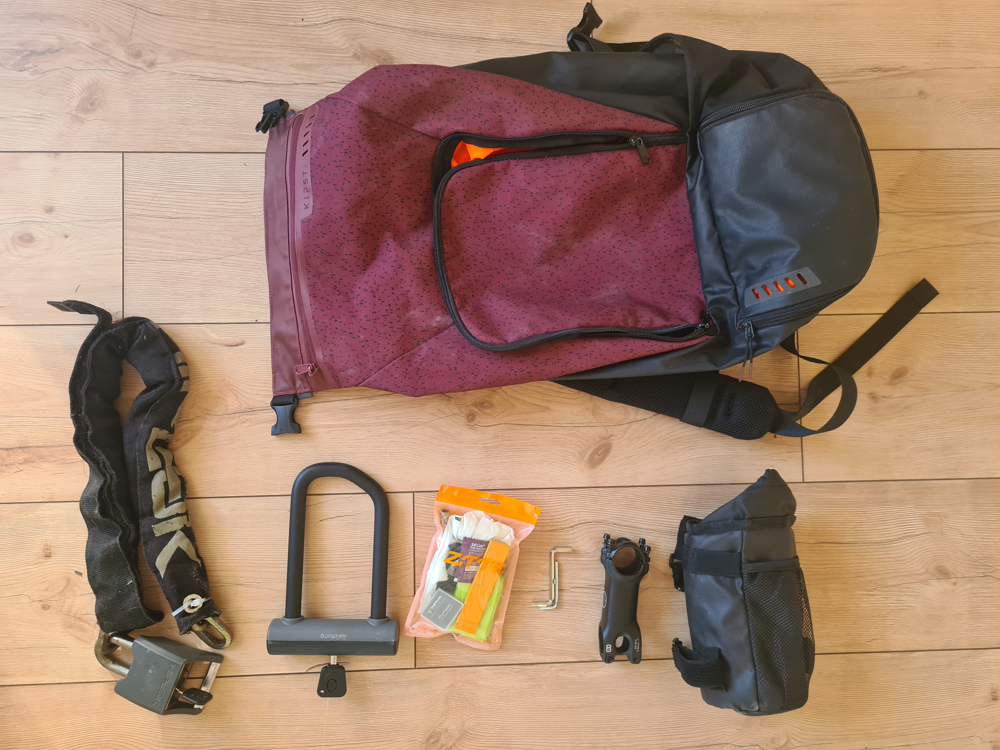
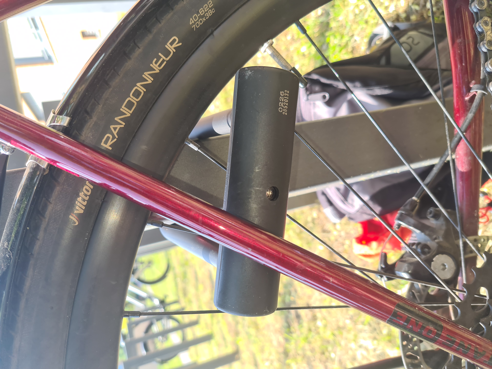

Hi Ben,

Thank you once again for booking my bike.

The bike is ready for the ride, but since I rode off myself, we have to do hand-off remotely.

## Pick-up

I will give the address and who to contact (the name on the doorbell downstairs and phone number) in the List & Ride chat. Here are more general instructions without personal info.

The bike will stand in my basement cellar. My neighbor will show you the way and provide you with the keys.

As agree I've removed the rack and fork mounts and left mudguards installed, September can be rainy and muddy.

## Spares & Misc

Next to the bike, I will leave  a backpack with the following:
1. Two locks. See Insurance on why.
2. Pouch with spare inner tune and repair kit if case you get more than one puncture.
3. Couple of hex key to adjust saddle and handlebar in all possible dimensions.
4. Handlebar pocket thingy. Although there are two bottle cages, it's very convenient to have a bit of storage directly in front of you.
5. Shorter handlebar stem to swap. At the moment I have a 11cm handlebar stem installed, the spare one is 9cm. If pivoting the handlebar will not be enough for food reach and comfort, this 2cm might do the trick. Let me know if you want to install it in advance.

Feel free to take the whole backpack or only the things you deem necessary.

## Insurance & locking requirements

For insurance to work, you have to lock the bike to some immovable object, unless you store in a private place. Both locks I left are compliant with insurance requirements, but one is heavy and easy to lock on something, while another is compact but requires some trickery to lock on something immovable. 
With a small lock I usually lock in on the bike rack and one seat stay and few spokes as shown on the image below.

Here's important part on locking requirements from the insurance:

> If the following locking requirements are not met a theft claim will not be covered;
> - Whenever the bike is left unattended away from a private storage location* by the rider, it must be locked to an immovable object using a Sold Gold Secure or an ART (category 2 or higher) approved lock [...], otherwise theft won’t be covered.

and 

> The Rider must:
> - **Report claims during the rental period**
> - In addition, you must provide Laka with any other evidence they require in order to validate a claim. This might include **photographic evidence of the bike or lock you used**, photographs of damage to the bike or a police statement reference number.

Long story short.  Feel free to pick one, or none if you are planning to store the bike in private space. Lock the bike, and make a photo of how you did that. See the rest of in Insurance Certificate you can find on list'n'ride.

# Drop-off

I think the best option will be if you can place the bike back to the cellar and drop the cellar, lock it and drop keys into my mailbox. My surname is on the label.

Let me know if this plan works for you or if you have any questions.

Signing off

I hope you will have a great time with your dad, have fun and stay safe.

Best,
Juri
